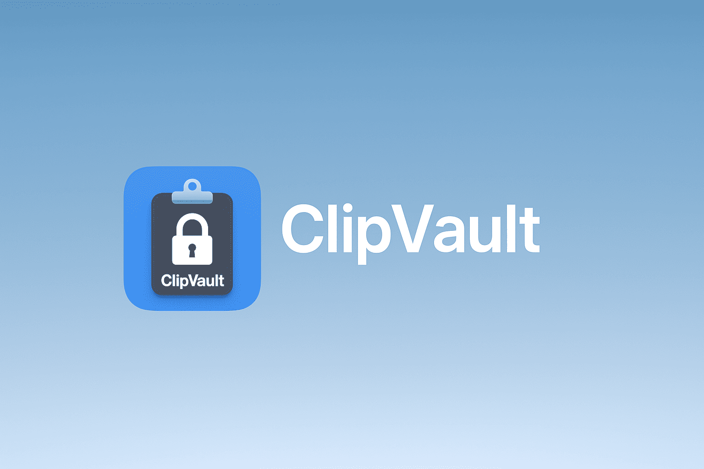

# ClipVault



A secure, privacy-focused clipboard manager for macOS with AES-256-GCM encryption.

## Features

- **Automatic clipboard monitoring** - Captures all clipboard changes in real-time
- **AES-256-GCM encryption** - All content encrypted at rest with keys in macOS Keychain
- **Smart content filtering** - Auto-detects and excludes passwords, API keys, SSH keys, credit cards
- **Rich text support** - Preserves bold, italic, colors, and formatting
- **Source app tracking** - See which app each item came from with native icons
- **Pin important items** - Keep frequently used snippets at the top
- **Real-time search** - Instantly filter clipboard history
- **Auto-paste** - One-click paste without keyboard commands

## Installation

### Homebrew (Recommended)

```bash
brew install eddmann/tap/clipvault
```

### Manual Download

1. Download the latest release from [GitHub Releases](https://github.com/eddmann/ClipVault/releases)
2. Move `ClipVault.app` to Applications
3. Double-click to open

The app is **signed and notarized** by Apple.

## Usage

- Click the menu bar icon to view recent clipboard history and pinned items
- Use real-time search to instantly find any item you're looking for
- Click an item to copy it, or select "View All Clipboard History" to browse your complete history

## Requirements

- macOS 12.0 (Monterey) or later
- Universal Binary (Intel + Apple Silicon)

## Security

- All content encrypted at rest (AES-256-GCM)
- Encryption keys stored in Keychain with device-only access
- No network transmission or telemetry
- Popular password managers excluded by default
